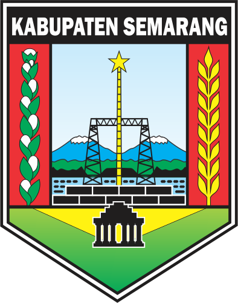

# 📱 CatatKas BUMDes & UMKM (KasKu)

<p align="center">
  
  &nbsp;&nbsp;&nbsp;&nbsp;&nbsp;&nbsp;&nbsp;&nbsp;
  
</p>

<p align="center">
  <b>Aplikasi Pencatatan Keuangan Harian BUMDes & UMKM Desa Manggihan</b><br/>
  Program Pengabdian KKN GIAT 16 Universitas Negeri Semarang (UNNES)
</p>

<p align="center">
  
  
  
  
</p>

---

## 📌 Mengenai CatatKas

**CatatKas** (KasKu) adalah aplikasi *mobile* berbasis **Flutter** yang dirancang khusus untuk mempermudah pelaku UMKM, pengelola BUMDes, dan warga Desa Manggihan dalam mencatat arus kas (pemasukan dan pengeluaran) secara praktis, cepat, dan 100% *offline* (tanpa tergantung koneksi internet).

---

## ✨ Fitur-Fitur Utama

- ⚡ **Ketik Cepat (*Quick Input Parsing*)**
  - Cukup ketik kalimat alami seperti `"jual bawang merah 1kg 20rb"` atau `"beli pupuk 2 50rb"`.
  - Sistem otomatis memisahkan jenis transaksi, nama barang, jumlah, satuan, dan total harga secara *real-time*.
- 📊 **Halaman Terpadu Riwayat & Laporan Keuangan**
  - Pemfilteran rentang tanggal interaktif (*Hari Ini, Minggu Ini, Bulan Ini, Semua, Pilih Tanggal*).
  - Ringkasan otomatis Total Pemasukan, Total Pengeluaran, dan Laba/Rugi Bersih.
  - **Tampilan Anti-Jebol**: Nominal besar (ratusan juta/miliaran/triliun) otomatis *auto-scale* (`FittedBox`) sehingga tampilan selalu rapi di semua ukuran layar.
- 📄 **Cetak & Bagikan Laporan PDF**
  - Generate dokumen PDF laporan keuangan formal yang siap cetak.
  - PDF otomatis tersimpan di folder *Download* dan dapat langsung dibuka via PDF Viewer bawaan atau dibagikan via WhatsApp/Email.
- 📂 **Backup & Restore Data (CSV)**
  - Ekspor seluruh catatan kas ke file format CSV di folder Download HP.
  - Fitur Restore untuk mengembalikan catatan keuangan saat berganti perangkat.
- 🏷️ **Katalog Produk Langganan**
  - Menyimpan daftar barang dan harga standar untuk mempercepat pengisian manual dengan fitur *Autocomplete*.

---

## 🏗️ Struktur Direktori Proyek

```text
CatatKas/
├── assets/
│   └── images/                     # Logo UNNES, Kab. Semarang, dan aset gambar
├── lib/
│   ├── main.dart                   # Entry point aplikasi & tema utama
│   ├── core/
│   │   ├── theme.dart              # Theme system (Google Fonts Outfit, Maroon & Gold)
│   │   ├── database/
│   │   │   └── database_helper.dart# SQLite CRUD Transaksi & Produk
│   │   ├── models/
│   │   │   ├── transaction_item.dart
│   │   │   └── product_item.dart
│   │   └── utils/
│   │       ├── currency_formatter.dart
│   │       ├── transaction_parser.dart
│   │       ├── pdf_helper.dart
│   │       └── backup_helper.dart
│   └── ui/
│       ├── widgets/               # Custom UI Components (PrimaryButton, CustomTextField)
│       └── screens/
│           ├── splash_screen.dart
│           ├── onboarding_screen.dart
│           ├── home_screen.dart
│           ├── add_transaction_screen.dart
│           ├── history_screen.dart
│           ├── product_screen.dart
│           ├── settings_screen.dart
│           └── about_screen.dart
└── pubspec.yaml                    # Dependensi Flutter & aset
```

---

## 🚀 Panduan Memulai (*Getting Started*)

### Prasyarat:
- [Flutter SDK](https://docs.flutter.dev/get-started/install) (versi 3.10.0 atau lebih baru)
- [Dart SDK](https://dart.dev/get-started/sdk)
- Android Studio / VS Code dengan plugin Flutter

### Langkah-Langkah Jalankan Proyek:

1. **Clone Repositori**:
   ```bash
   git clone git@github.com:imanyunar/KasKu.git
   cd KasKu
   ```

2. **Install Dependensi**:
   ```bash
   flutter pub get
   ```

3. **Jalankan Aplikasi di Emulator / Perangkat**:
   ```bash
   flutter run
   ```

4. **Build APK Rilis (Android)**:
   ```bash
   flutter build apk --release
   ```
   *File APK rilis akan tersimpan di `build/app/outputs/flutter-apk/app-release.apk`.*

---

## 🛠️ Teknologi & Library Utama

| Package | Versi | Fungsi |
|---|---|---|
| `flutter_screenutil` | `^5.9.3` | Skala UI responsif berbagai resolusi layar |
| `sqflite` | `^2.3.3` | Database lokal offline SQLite (`catatkas.db`) |
| `pdf` & `printing` | `^3.11.1` | Pembuatan dokumen laporan berformat PDF |
| `open_filex` | `^4.5.0` | Membuka file PDF langsung di viewer Android |
| `share_plus` | `^10.0.0` | Membagikan dokumen PDF & backup data |
| `google_fonts` | `^6.2.1` | Tipografi modern (Font Outfit) |

---

## 👨‍💻 Kontributor & Tim Pengembang

Aplikasi ini dikembangkan sebagai bagian dari program kerja pengabdian masyarakat **GIAT 16 Universitas Negeri Semarang (UNNES)** di **Desa Manggihan, Kabupaten Semarang**.

* **Tim Pengembang**: UNNES GIAT 16 Desa Manggihan
* **Repositori GitHub**: [imanyunar/KasKu](https://github.com/imanyunar/KasKu)

---

<p align="center">
  <i>Dibuat dengan ❤️ untuk kemajuan UMKM & BUMDes Desa Manggihan.</i>
</p>
